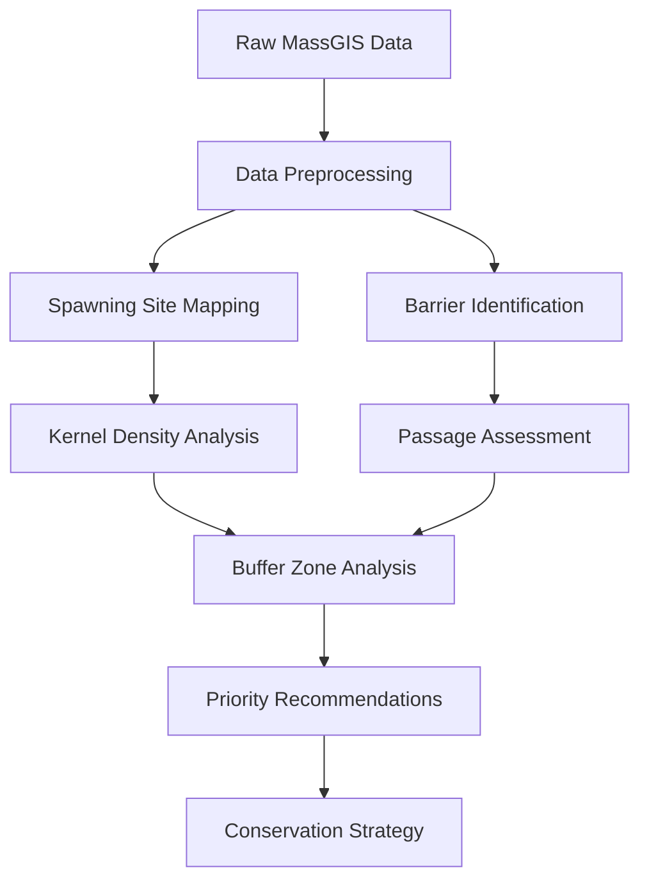
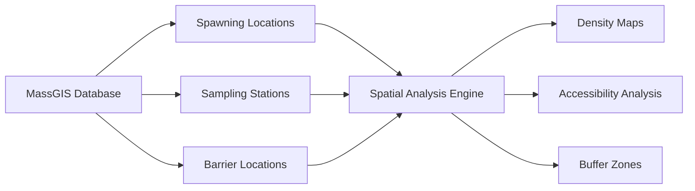
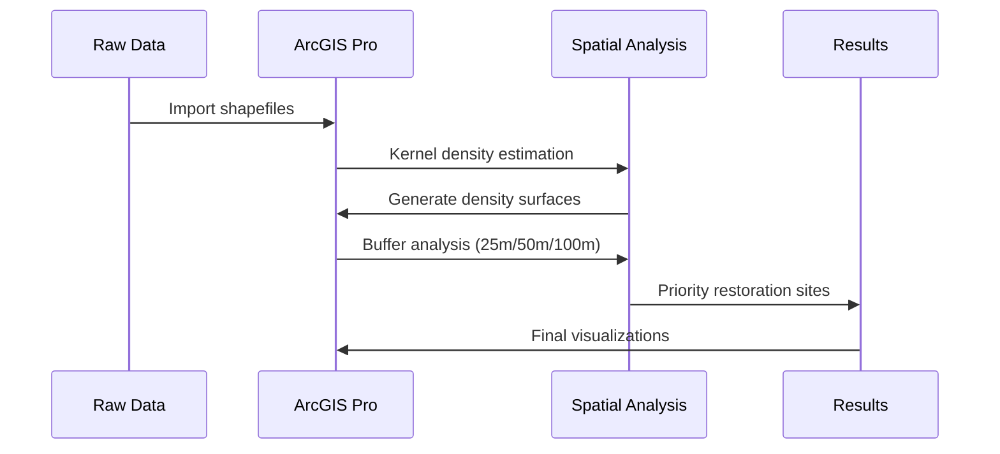
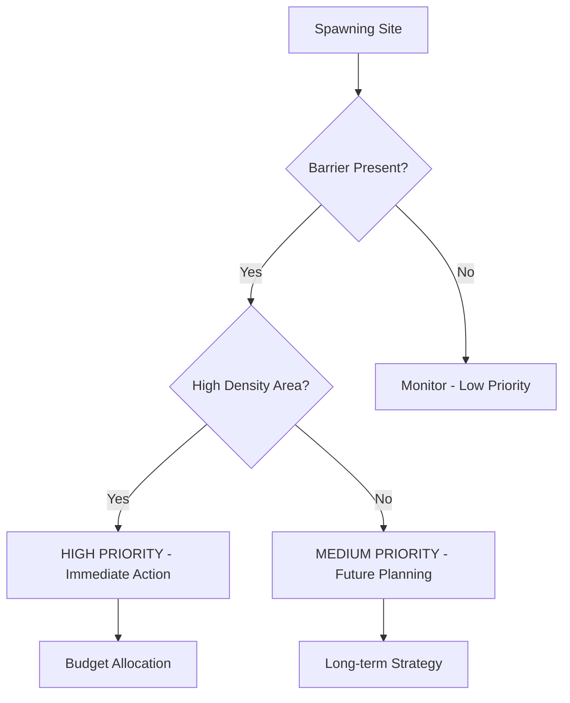
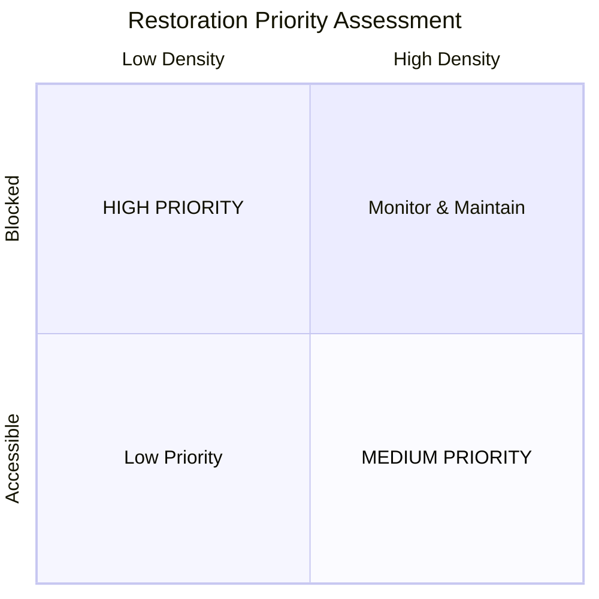

# River Herring Habitat Analysis: Massachusetts Coastal Waters
## Spatial Analysis of Spawning Habitats and Migration Barriers

🌊 **Conservation Impact** | 🗺️ **GIS Analysis** | 📊 **Spatial Statistics**

### **Executive Summary**
- Problem statement with quantified impact
- Solution overview with key methodologies
- Results summary with actionable recommendations

### **📋 Project Workflow** 

### **🎯 Problem Statement**
- Massachusetts river herring population decline
- Stakeholder needs (DMF, conservation groups)
- Data-driven decision making requirements

### **📊 Data Architecture**

### **🔬 Methodology**

**Analysis Pipeline:**

### **⚙️ Technical Implementation**

**Decision Logic for Restoration Priority:**

### **🎯 Impact & Recommendations**

**Priority Matrix:**

### **🔧 Technical Stack**
- **GIS Platform**: ArcGIS Pro
- **Spatial Analysis**: Kernel Density Estimation, Buffer Analysis
- **Data Format**: Shapefiles, Feature Classes
- **Statistical Methods**: Distribution analysis, spatial clustering
- **Output**: Interactive maps, statistical summaries
